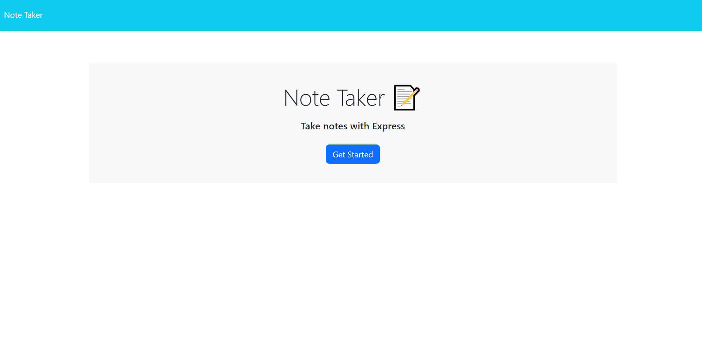
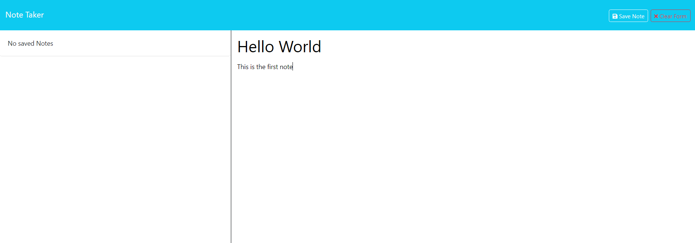

  # Note Taker
  
  ## Description

  This web application allows users to write and save notes, so that they can organize thoughts and keep track of important tasks.

  ## Table of Contents 

  - [Description](#description)

  - [Table of Contents](#table-of-contents)

  - [Installlation](#installlation)

  - [Usage](#usage)

  - [License](#license)

  - [Contributing](#contributing)

  - [Tests](#tests)

  - [Questions](#questions) 

  ## Installation

  N/A

  ## Usage

  To use this application click on the [link here](https://obscure-garden-95810-97ef6913385c.herokuapp.com/) or use the link in the about section of [this repository](https://github.com/Kal-a11y/note-taker). When the page opens, click the get started button. Existing notes can be viewed on the left hand column and new notes can be created on the right. Start typing in the right column to add the note title and text. When there is text in either area click the clear form to delete all of the current text.  When there is both a title and text for a note, the option to save the note will appear in the navigation bar. When a note is saved, it then appears on the left column. Click a note on the left column to review the note.

  
  

  ## License

  N/A

  ## Contributing

  There are no guidelines for contributing

  ## Tests

  N/A

  ## Questions

  - GitHub: [Kal-a11y](https://github.com/Kal-a11y/)
  - Email: N/A

  